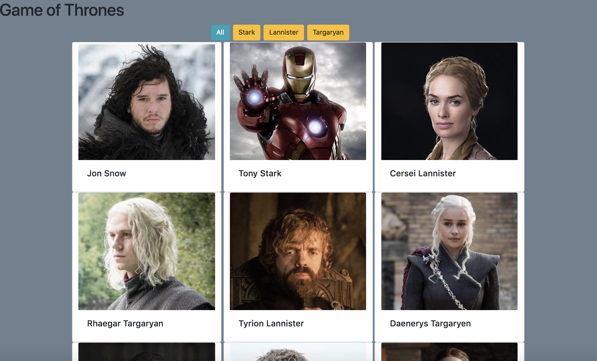

# Thrones

### About This App
The Game of Thrones app was an in-class project.  Our instructor walked us through creating this app step-by-step starting at the planning stages.  We learned about using more complicated file structure and breaking up javascript into smaller, more manageable chunks using modules to export 
and import blocks of code.  We also learned how to JavaScript Object Notation (Json) and XML Http Requests (XHR).  

### Provided Guide
 <a href="https://github.com/nss-evening-cohort-8/thrones">Thrones</a>

### How to Use This App
1. Install `http-server` from `http://www.npmjs.com/package/htt-server`
2. In Terminal, navigate to the project folder and type: `http-server -p 8080`
3. In your browser, navigate to `http://localhost:8080`

Click on a House Button to sort the characters by house.  Click on a character card to
see their details
 

### Screen Shot
